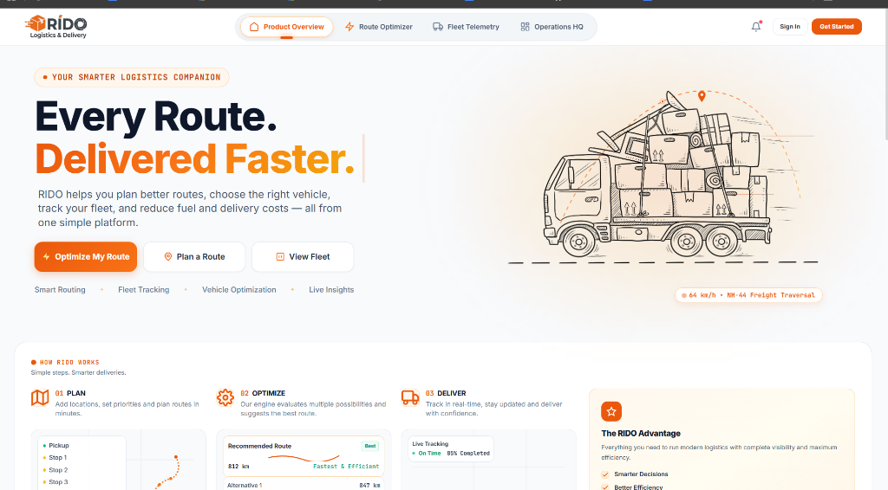

# RIDO — Enterprise Fleet Logistics & Route Optimization Platform

[](https://opensource.org/licenses/MIT)
[](https://developer.mozilla.org/en-US/docs/Web/JavaScript)
[](https://tailwindcss.com/)
[](https://leafletjs.com/)

> **Modern, Algorithmic Fleet Telemetry and Inter-City Freight Co-Optimization Platform tailored for Indian Logistics Networks.**



---

## 1. Project Purpose & Core Capabilities

**RIDO** is an enterprise logistics intelligence software suite designed to solve complex Vehicle Routing Problems (VRP) and multi-factor fleet dispatch allocations across Indian national highways, expressways, and urban delivery clusters.

### Key Operational Capabilities:
- **Topological 2-Opt Edge-Swap Optimization**: Untangles redundant transit crossings and computes mathematically optimal stop sequences.
- **Payload & Powertrain Co-Optimization**: Matches shipments against vehicle payload capacity, EV battery range envelopes, and fuel efficiency.
- **Thermodynamic OpEx Economics**: Models diesel burn, EV power tariffs, driver allowances, commercial NHAI FASTag highway tolls, and scheduled tire wear.
- **Interactive Leaflet Map Engine**: Real-world highway geometry via OSRM, live traffic congestion overlays, and multi-speed truck traversal simulation.
- **"What-If" Scenario Sandbox**: Stress-tests operational resilience against fuel price spikes, vehicle breakdowns, cargo surges, and EV transition ROI.
- **Role-Based Access Control (RBAC)**: Distinct, secure dashboard interfaces for Fleet Managers, Corporate Dispatchers, and Commercial Drivers.

---

## 2. Architecture & Directory Structure

```
LogiRoute/
├── index.html                  # Semantic HTML5 Application Structure & Layout
├── style.css                   # Complete Vanilla CSS Design System & Theme Tokens
├── logo.png                    # RIDO Brand Identity Asset
├── truck_hero.png              # Logistics Vehicle Visual Asset
├── vercel.json                 # Vercel Deployment & SPA Routing Configuration
├── README.md                   # Technical Documentation & Developer Guide
└── js/
    ├── config.js               # Centralized Configuration, Constants & Economics
    ├── utils.js                # Geospatial Math, Formatters, Sanitization & Debounce
    ├── state.js                # Unified Reactive Application State Store
    ├── api.js                  # External HTTP API Client Layer (OSRM, India Post, Nominatim)
    ├── storage.js              # Centralized LocalStorage Persistence & Version Migration
    ├── locations.js            # Pan-India Cities, Terminals & Express Corridors Database
    ├── optimizer.js            # 2-Opt TSP Solver, Fleet Allocation & OpEx Modeling
    ├── map.js                  # Leaflet Map Engine, Layers, Pins & Traversal HUD
    ├── fleet.js                # Fleet Roster Management, CRUD, Filters & Search
    ├── scenarios.js            # What-If Simulation Sandbox & Delta Analysis
    ├── analytics.js            # Canvas 2D Charts (Distance, Fuel, Utilization, Carbon)
    ├── ui.js                   # Modals, Toast Notifications, Web Audio Synth & ⌘K Palette
    └── app.js                  # Main Application Coordinator & Event Bindings
```

---

## 3. Getting Started & Local Development

RIDO is built using standard, framework-free web standards (HTML5, Vanilla CSS, Vanilla Modern ES6+ JavaScript). It does not require complex build steps or node compile toolchains.

### Running with Python:
```bash
# Python 3.x Built-in HTTP Server
python -m http.server 5500
```
Open **[http://localhost:5500](http://localhost:5500)** in any modern web browser.

### Running with Node / NPM:
```bash
npx serve . -p 5500
```

---

## 4. APIs & External Providers

| Provider | Purpose | Endpoint / Protocol | Fallback Mechanism |
| :--- | :--- | :--- | :--- |
| **Project OSRM** | Real Highway Road Geometry | `https://router.project-osrm.org/route/v1/driving` | High-density interpolated Haversine polyline |
| **India Post API** | 6-Digit Postal PIN Code Resolver | `https://api.postalpincode.in/pincode/{PIN}` | Nominatim geocoding / Local City DB |
| **OSM Nominatim** | Pan-India Locality & City Geocoder | `https://nominatim.openstreetmap.org/search` | 3,000+ entry offline logistics database |
| **CARTO & Esri** | Leaflet Multi-Layer Map Tiles | CARTO Voyager, Esri Satellite, Dark Matter | Browser cache |

---

## 5. Algorithmic Routing & Co-Optimization

### 1. Great-Circle Haversine Distance
Computes high-precision spherical distance between geographic coordinates:
$$\Delta\sigma = 2 \arcsin\left(\sqrt{\sin^2\left(\frac{\Delta\phi}{2}\right) + \cos\phi_1\cos\phi_2\sin^2\left(\frac{\Delta\lambda}{2}\right)}\right)$$
$$d = R \cdot \Delta\sigma \quad (R = 6371\text{ km})$$

### 2. Nearest Neighbor Baseline with Priority Bias
Constructs a baseline dispatch tour starting from Origin Hub $[A]$:
- `Urgent` consignments receive a $0.65\times$ distance bias factor.
- `High` priority consignments receive a $0.82\times$ distance bias factor.

### 3. 2-Opt Iterative Edge-Swap Heuristic
Iteratively swaps pairwise tour edges to untangle geometric path crossings:
$$\text{Tour} = [v_1, \dots, v_i, v_k, v_{k-1}, \dots, v_{i+1}, v_{k+1}, \dots, v_n]$$
Executes up to 350 iterations until no sub-route inversion yields distance improvements $>0.001\text{ km}$.

### 4. Enterprise Multi-Factor Vehicle Allocation
Scores candidate fleet vehicles against operational criteria:
- **Payload Compliance**: Rejects vehicles where $\sum \text{weight} > \text{Payload}_{\max}$.
- **Range Feasibility**: Verifies remaining battery/fuel range with a $15\%$ safety margin.
- **Powertrain Optimization**: Applies green incentives for Electric Vehicles (zero direct tailpipe CO2).

---

## 6. Storage & State Persistence

- **Primary Storage Key**: `rido_state_v1`
- **Auto-Migration Engine**: Automatically detects and migrates legacy data schemas (`routesaathi_state_v1`, `optipath_data_v5`, `optipath_data_v4`).
- **Persisted Elements**:
  - Full vehicle roster modifications (Add, Edit, Delete, Status cycles)
  - Selected Origin & Destination hubs, custom coordinates, and stops checklist
  - "What-If" scenario sandbox parameters
  - Dispatcher authentication session (`rido_user_session`)
- **JSON Backup Export/Import**: Dispatchers can export current configurations as structured `.json` files and restore them anytime.

---

## 7. Real-Time vs Simulated Functionality

- **Genuinely Real**:
  - Distance calculations (Haversine + OSRM road geometry)
  - 2-Opt TSP optimization and waypoint reordering
  - Multi-factor vehicle co-optimization scoring
  - LocalStorage persistence and backup export/import
  - Live geocoding and India Post 6-digit PIN resolution
  - Fleet CRUD actions and dynamic KPI recalculations
  - What-If scenario delta calculations
  - Canvas 2D chart rendering
- **Simulated / Telemetry Demo**:
  - Highway conveyor animation (indicated as `"Live Operational Wave / Simulation Feed"`)
  - Vehicle traversal simulation along polyline (animated at 1x, 3x, 8x, 16x speed)
  - Synthesized audio chimes via HTML5 Web Audio API

---

## 8. License & Standards

- Designed and engineered with semantic HTML5, Vanilla CSS, and modern modular ES6+ JavaScript.
- Built for enterprise maintainability, high performance, and UI consistency.
